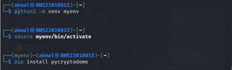
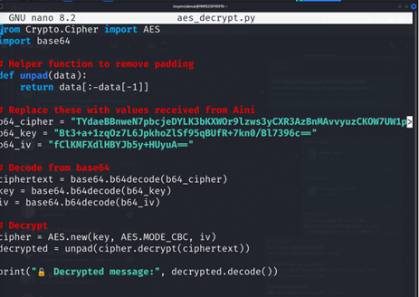
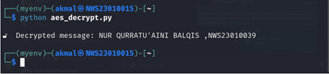
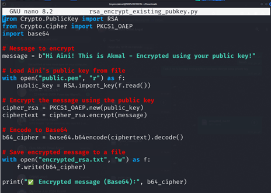
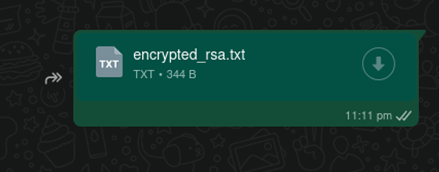
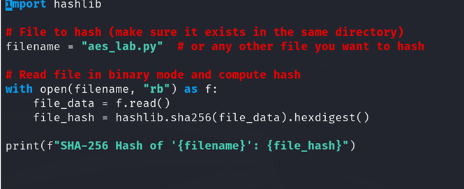
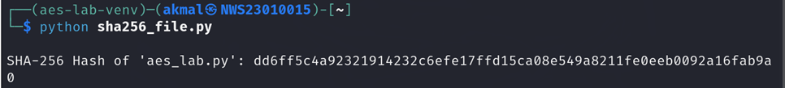
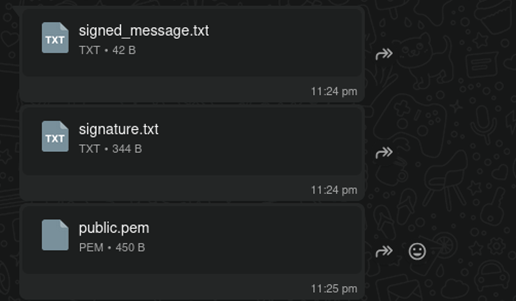
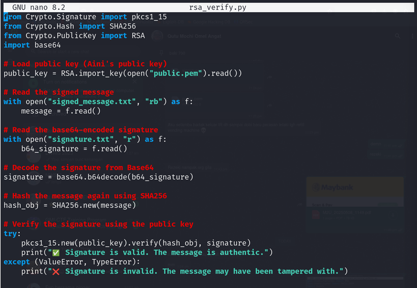
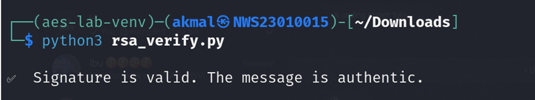

## Lab 4 :Implementing Cryptography with Python

Objective :
1. Implement symmetric encryption using AES.
2. Implement asymmetric encryption using RSA.
3. Explore hashing using SHA-256.
4. Implement digital signatures using RSA.

## Task 1: Symmetric Encryption (AES)

1. Implement AES encryption and decryption in Python.
2. Encrypt a sample message (e.g., "Cryptography Lab by <Your Name, Student ID>!") with a secret key.
3. Decrypt the ciphertext back to the original message.

Sender (Aini)

In python file 
from Crypto.Cipher import AES
from Crypto.Random import get_random_bytes
import base64

# Padding function
def pad(data):
    pad_len = 16 - len(data) % 16
    return data + bytes([pad_len] * pad_len)

def unpad(data):
    return data[:-data[-1]]

# AINI - ENCRYPT
message = b"NUR QURRATU'AINI BALQIS ,NWS23010039"
key = get_random_bytes(32)  # 256-bit
iv = get_random_bytes(16)
cipher = AES.new(key, AES.MODE_CBC, iv)
ciphertext = cipher.encrypt(pad(message))

b64_cipher = base64.b64encode(ciphertext).decode()
b64_key = base64.b64encode(key).decode()
b64_iv = base64.b64encode(iv).decode()

print("\nTASK 1 - AES")
print("🔐 Encrypted (Base64):", b64_cipher)
print("🔑 Key (Base64):", b64_key)
print("🧊 IV (Base64):", b64_iv)

RECEIVER 

In the environment : 

<pre> python3 -m venv myenv </pre>

to start

<pre> source myenv/bin/activate </pre>

download 

<pre> pip install pycryptodome </pre>

Create file with this python 

<pre>from Crypto.Cipher import AES
import base64

# Helper function to remove padding
def unpad(data):
    return data[:-data[-1]]

# Replace these with values received from Aini
b64_cipher = "TYdaeBBnweN7pbcjeDYLK3bKXWOr9lzws3yCXR3AzBnMAvvyuzCKOW7UW1pvaIzQ"
b64_key = "Bt3+a+1zqOz7L6JpkhoZlSf95qBUfR+7kn0/Bl7396c=="
b64_iv = "fClKMFXdlHBYJb5y+HUyuA=="

# Decode from base64
ciphertext = base64.b64decode(b64_cipher)
key = base64.b64decode(b64_key)
iv = base64.b64decode(b64_iv)

# Decrypt
cipher = AES.new(key, AES.MODE_CBC, iv)
decrypted = unpad(cipher.decrypt(ciphertext))

print("🔓 Decrypted message:", decrypted.decode())
</pre>

run 

<pre> python aes_decrypt.py </pre>

## TASK 2 :

i received public key shared by Aini

Create file to decrypt 

<pre>nano rsa_encrypt_existing_pubkey.py </pre>

 i'll use this python code to encrypt my message using publice key share by Aini

from Crypto.PublicKey import RSA
from Crypto.Cipher import PKCS1_OAEP
import base64

# Message to encrypt
message = b"Hi Aini! This is Akmal - Encrypted using your public key!"

# Load Aini's public key from file
with open("public.pem", "r") as f:
    public_key = RSA.import_key(f.read())

# Encrypt the message using the public key
cipher_rsa = PKCS1_OAEP.new(public_key)
ciphertext = cipher_rsa.encrypt(message)

# Encode to Base64
b64_cipher = base64.b64encode(ciphertext).decode()

# Save encrypted message to a file
with open("encrypted_rsa.txt", "w") as f:
    f.write(b64_cipher)

print("✅ Encrypted message (Base64):", b64_cipher)

Then i'll share the encypted file to Aini

She can open this file and view the content using her private key

TASK 3 : Hashing (SHA-256)

Compute the SHA-256 hash of a file/message.

•	uses the hashlib library to compute the SHA-256 hash of a file named aes_lab.py. 
•	opens the file in binary mode to accurately read its raw content
•	 applies the SHA-256 hashing algorithm to generate a unique hexadecimal digest. 

The resulting hash is printed to the terminal and can be used to verify the file’s integrity—any change to the file's content will result in a completely different hash, making this method useful for detecting tampering or corruption.

TASK 4 : 

Received file from Aini

now let's try to verify the signature using this code 

create file to verify using python

<pre>from Crypto.Signature import pkcs1_15
from Crypto.Hash import SHA256
from Crypto.PublicKey import RSA
import base64

# Load public key (Aini's public key)
public_key = RSA.import_key(open("public.pem").read())

# Read the signed message
with open("signed_message.txt", "rb") as f:
    message = f.read()

# Read the base64-encoded signature
with open("signature.txt", "r") as f:
    b64_signature = f.read()

# Decode the signature from Base64
signature = base64.b64decode(b64_signature)

# Hash the message again using SHA256
hash_obj = SHA256.new(message)

# Verify the signature using the public key
try:
    pkcs1_15.new(public_key).verify(hash_obj, signature)
    print("✅ Signature is valid. The message is authentic.")
except (ValueError, TypeError):
    print("❌ Signature is invalid. The message may have been tampered with.")

</pre>

let's run the python file

<pre>python3 rsa_verify.py</pre>

