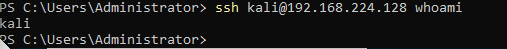

### Practical test 1 : ###

## TASK 1: Generate Your GPG Key Pair
 ##
Run the following command to start the key generation process:

``gpg --full-generate-key``

When prompted, choose the following options:

Key type: Select 1 for RSA and RSA.

Key size: Enter 4096.

Key expiry: Enter 1y for one year.

Confirm: Type y and press Enter.

After successful generation, GPG will display a message like:

View the key 

``gpg --list-keys``

## TASK 2 : Encrypt and Decrypt a File##

1. Create file 
File name : message.txt

Message : This file was encrypted by Akmal , NWS23010015

2. Encrypt the file with my public key and email

``gpg --output message.txt.gpg --encrypt --recipient nurmaizatulakmal.rashimi@student.gmi.edu.my message.txt

As we can see the file 'message.txt.gpg' exist after being encrypted

3. Decrypt the file using private key

``gpg --output decrypted_message.txt --decrypt message.txt.gpg``

We need to fill in the paraphrase

As result

We can see the message after decrypt it with the correct private key and correct pharaphase

## TASK 3 : Sign and Verify a Message ##

1. Create file
File name : signed_message.txt
Message : I, Nur Maizatul Akmal , declare this is my work

`` echo " I , Nur Maizatul Akmal , declare this is my work. " > signed_message.txt``

2. Sign the File Using GPG

Option 1 : Clearsign (Recommended for plain-text readable + signed)

``gpg --clearsign signed_message.txt``

As result , The file 'signed_message.txt.asc' created . Text file containing both message and the signature block.

3. Verify the signature

``gpg --verify signed_message.txt.asc``

## TASK 4 : Configure Passwordless SSH Authentication ##

1. Generate SSH key pair

``ssh-keygen -t rsa -b 4096 -C "Nur Maizatul Akmal-NWS23010015"

this command generates a strong RSA SSH key pair with a 4096-bit length

Evidence :

``cat `/.ssh/id_rsa.pub``

This public key is what we share with servers or services to allow secure SSH access without a password.

2. Configure SSH Access (remote VM)

``ssh-copy-id -i ~/.ssh/id_rsa.pub kali@192.168.224.128``

 This command copies public SSH key to the remote machine 192.168.224.128 for user kali, so I can log in via SSH without typing a password next time.

3. Test Passwordless SSH

``ssh kali@192.168.224.128``

Successfully access the remote VM without password using SSH

Evidence :

## Task 5 : Hash Cracking Challenge ##

Question 1 : SnZlcmV4IEF2IEpmcmNyZSBFeiBCcnJl

i use cyberchef and convert from decrypt to base 64
decrypt and i got 

" Jverex Av Jfrcre Ez Brre "

Then , i used the output and decrypt again using ROT13

i try to change the amount of rotate characters
Starting from 1 until 9

The plaintext = "Senang Je Soalan Ni Kaan"

Question 2 : 7b77ca1e2b3e7228a82ecbc7ca0e6b52

So , from the question it has 32 characters hexadecimal likely to be MD5

I put the hash in hash.txt file and run it using wordlist share by Sir Adli

``hashcat -m 0 -a 0 hash.txt mywordlist.txt``

Let's see what the decryption message

``hashcat --show -m 0 -a 0 hash.txt mywordlist.txt``

The plaintext = "Assalamualaikum Semua"

Question 3 : e583cee9ab9d7626c970fd6e9938fcb2d06fbbd12f1c1a3c6902a215808c825c

Create a file

``hashcat -m 1400 -a 0 sha256hash.txt mywordlist.txt``

Show the result 

``hashcat --show -m 1400 sha256hash.txt mywordlist.txt``

The plaintext = "Begitulah Lumrah Kehidupan"

 