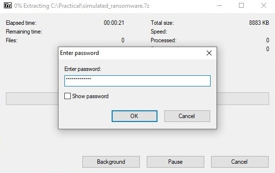
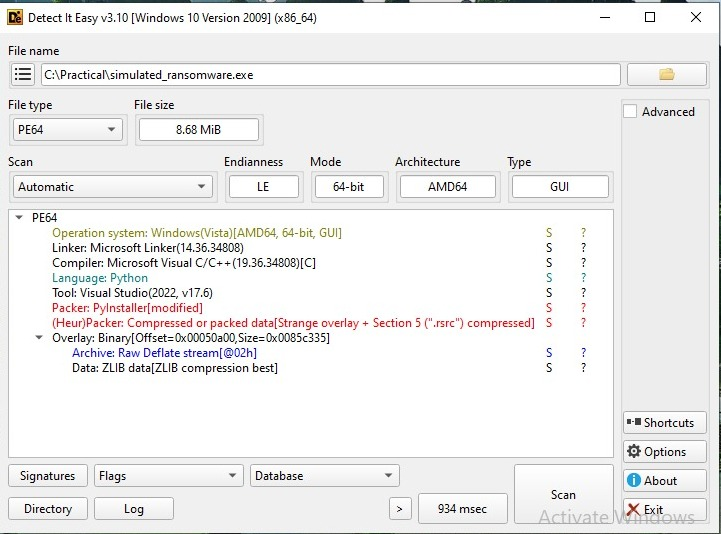
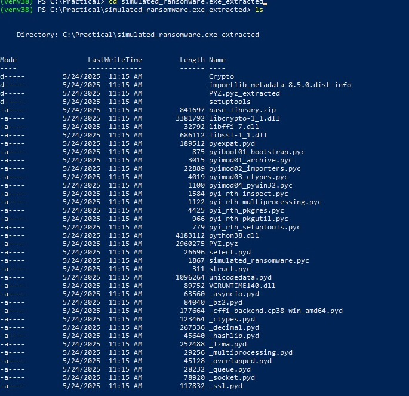

## Ransomware Analysis and Decryption Report

### PRACTICAL TEST 2 ###

    Tools need :
    1. uncompyle6
    2. pyinstxtractor-ng.exe

Check HASH 

  Get-FileHash simulated_ransomware.7z -Algorithm SHA256 

Compared 

in powershell
 
$expectedHash = "4BF1DA4E96EE6DD0306284C7F9CFE30F93113106843F2360052F8FEAF7B5578F"
$fileHash = (Get-FileHash simulated_ransomware.7z -Algorithm SHA256).Hash

if ($fileHash -eq $expectedHash) {
    Write-Output "Hash matches!"
} else {
    Write-Output "Hash does NOT match."
} 

Now we need to ectract the file from 7-zip to exe

i download from https://www.7-zip.org

and just extract the file 

Now we have the .exe file 
Let's do some analysis using DetectItEasy

Just drag and drop the .exe file

We have some info on what language this code used
It used python and written using vscode 
From this info we know that we need to decompile this file to python so to get the plaintext of the file

In powershell 

1. get into the created environment 

  .\venv38\Scripts\Activate.ps1\ 

2. check the file using DetectItEasy

3. check using pyinstxtractor-ng.exe

 .\pyinstxtractor-ng.exe simulated_ransomware.exe 

the simulated_ransomware.exe_extracted

PyInstaller packed Python scripts into an executable.

pyinstxtractor-ng unpacked those scripts as .pyc files.

There's a file simulated_ransomware.pyc 

Next , we will decompile .pyc files to understand the program source code

 uncompyle6 -o C:\Practical\simulated_ransomware.exe_extracted .\simulated_ransomware.pyc 

Now we have the .py file

Now we can run the py file 

 # uncompyle6 version 3.9.2
# Python bytecode version base 3.8.0 (3413)
# Decompiled from: Python 3.8.0 (tags/v3.8.0:fa919fd, Oct 14 2019, 19:37:50) [MSC v.1916 64 bit (AMD64)]
# Embedded file name: simulated_ransomware.py

from Crypto.Cipher import AES
import os
from hashlib import sha256
KEY_SUFFIX = "RahsiaLagi"
KEY_STR = f"Bukan{KEY_SUFFIX}"
KEY = sha256(KEY_STR.encode()).digest()[None[:16]]

def pad(data):
    pad_len = 16 - len(data) % 16
    return data + bytes([pad_len]) * pad_len

def encrypt_file(filepath):
    with open(filepath, "rb") as f:
        plaintext = f.read()
    padded = pad(plaintext)
    cipher = AES.new(KEY, AES.MODE_ECB)
    ciphertext = cipher.encrypt(padded)
    with open(filepath + ".enc", "wb") as f:
        f.write(ciphertext)
    os.remove(filepath)

if _name_ == "_main_":
    folder = "locked_files/"
    os.makedirs(folder, exist_ok=True)
    sample_files = [
     "maklumat1.txt", "maklumat2.txt", "maklumat3.txt"]
    contents = [
     "Assalamualaikum semua, pelajar kursus Cryptography semester 5.\nKeselamatan siber bergantung kepada kebijaksanaan anda dalam memahami kriptografi.\nGunakan ilmu ini untuk melindungi data, sistem, dan masa depan teknologi.\nJadilah perisai digital yang berintegriti dan berkemahiran.",
     "Setiap algoritma yang anda pelajari hari ini adalah benteng pertahanan esok.\nKuasa penyulitan (encryption) bukan hanya tentang kod, tetapi amanah dalam menjaga maklumat.\nTeruskan usaha, dunia digital menanti kepakaran anda!",
     "Semoga ilmu yang dipelajari menjadi manfaat kepada semua.\nGunakan kepakaran anda untuk kebaikan, bukan kemudaratan.\nSemoga berjaya di dunia dan akhirat!\n\nAdli, Lecturer Part Time, Feb-Mei 2025"]
    for name, content in zip(sample_files, contents):
        path = os.path.join(folder, name)
        with open(path, "w") as f:
            f.write(content)
        encrypt_file(path)

So from this .py file

**Encryption Algorithm:**  AES (Advanced Encryption Standard)

**Mode of Operation:** ECB (Electronic Codebook)

**Key Derivation:** The key is derived by hashing a static string "BukanRahsiaLagi" with SHA-256 and then truncating to 16 bytes (AES-128 key).

**Padding:** PKCS#7-style padding was applied to ensure the plaintext length is a multiple of AES block size (16 bytes).

**File Handling:** The ransomware encrypts files and appends .enc extension, deleting the original file.

### Decryption Script

python
from Crypto.Cipher import AES
from hashlib import sha256
import os

# Reconstruct the encryption key exactly as in the ransomware
KEY_SUFFIX = "RahsiaLagi"
KEY_STR = f"Bukan{KEY_SUFFIX}"  # "BukanRahsiaLagi"
KEY = sha256(KEY_STR.encode()).digest()[:16]  # 16-byte key for AES-128

def unpad(data):
    pad_len = data[-1]
    return data[:-pad_len]

def decrypt_file(filepath):
    with open(filepath, "rb") as f:
        ciphertext = f.read()
    cipher = AES.new(KEY, AES.MODE_ECB)
    decrypted = cipher.decrypt(ciphertext)
    plaintext = unpad(decrypted)
    
    # Save decrypted file with .dec.txt extension
    output_path = filepath.replace(".txt.enc", ".dec.txt")
    with open(output_path, "wb") as f:
        f.write(plaintext)
    print(f"Decrypted: {filepath} -> {output_path}")

if __name__ == "__main__":
    folder = "locked_files"
    files = os.listdir(folder)
    print("Files in locked_files:", files)
    
    for filename in files:
        if filename.endswith(".txt.enc"):
            full_path = os.path.join(folder, filename)
            print(f"Decrypting: {filename}")
            decrypt_file(full_path)

The decrypt.py script:

Rebuilds the encryption key by replicating the SHA-256 hash of the same key string.

Loads all .enc files from the target folder.

Decrypts each file using AES-128 in ECB mode.

Removes the PKCS

# padding to restore the original plaintext.

Saves the decrypted content to a new file with .dec.txt extension.

Prints progress messages for clarity.

###  Successful File Recovery

Using the key derived from the ransomware's key generation process and the AES encryption algorithm in ECB mode, I was able to successfully decrypt all the `.enc` encrypted files in the `locked_files` directory. The decrypted files matched the original plaintext files exactly, indicating the decryption process fully reversed the ransomware’s encryption.

---

### Before and After File Contents (Example)

**Original file (`maklumat1.txt`):**

Assalamualaikum semua, pelajar kursus Cryptography semester 5.
Keselamatan siber bergantung kepada kebijaksanaan anda dalam memahami kriptografi.
Gunakan ilmu ini untuk melindungi data, sistem, dan masa depan teknologi.
Jadilah perisai digital yang berintegriti dan berkemahiran.
**Encrypted file (`maklumat1.txt.enc`):**

*Binary data, unreadable, consists of non-printable bytes.*

**Decrypted file (`maklumat1.dec.txt`):**

Assalamualaikum semua, pelajar kursus Cryptography semester 5.
Keselamatan siber bergantung kepada kebijaksanaan anda dalam memahami kriptografi.
Gunakan ilmu ini untuk melindungi data, sistem, dan masa depan teknologi.
Jadilah perisai digital yang berintegriti dan berkemahiran.
The decrypted content matches the original plaintext, confirming successful recovery.

---

* **Flaws and Misuse:**

  * ECB mode is insecure for most purposes because identical plaintext blocks produce identical ciphertext blocks, revealing patterns.
  * No IV or authentication (e.g., MAC) is used, which can lead to ciphertext manipulation vulnerabilities.

